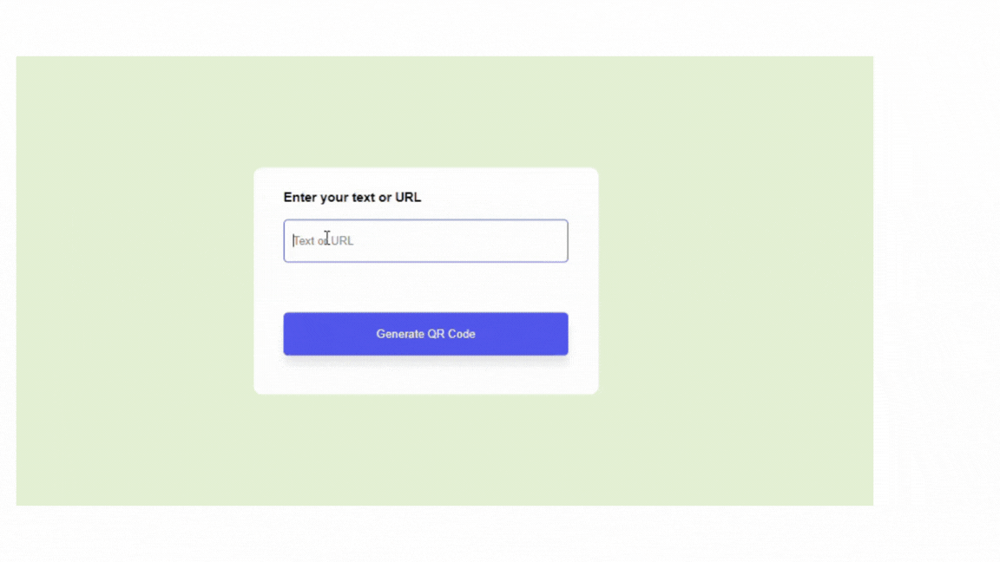

<h1> 📱 QR Generator </h1>

<h3> This project generates a QR code when a text or a site URL is entered. The generated QR code can be scanned via a mobile device, allowing you to access or view the linked content. </h3>

<h2> 🛠️ Built With: </h2>

<h4> 
<ul>
<li> <b> HTML: </b> For creating the structure of the web page. </li>
<li> <b> CSS: </b> For styling the page. </li>
<li> <b> JavaScript: </b> To make the QR code generation dynamic. </li>
 </ul>
</h4>

<h1> ✨ Features: </h1>

<h4> 
<ul>
<li> Generate QR codes for text or URLs.  </li>
<li> Scan the QR code with a mobile device to access the content. </li>
</ul>
</h

# Live Demo

